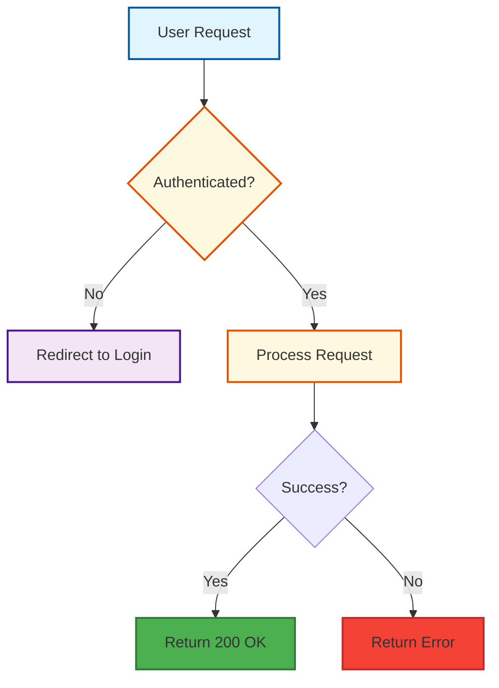

# Documentation Standards

Guidelines for creating consistent and beautiful documentation.

## Markdown Structure

### Standard Layout
```markdown
# [Title]

[Brief description of purpose]

## Table of Contents
- [Section 1](#section-1)
- [Section 2](#section-2)

## Section 1
[Content]

## Section 2
[Content]
```

### Headings
- Use `Title Case` for Level 1 headers.
- Use `Sentence case` for Level 2+ headers.
- Keep depth shallow (max 3 levels deep preferably).

## Mermaid Diagrams

Use Mermaid for all architectural and flow diagrams.

### Color Palette
We use a specific color palette for consistency:

- **Primary (Blue)**: `#e1f5fe` / `#01579b` (Questions, Main Nodes)
- **Secondary (Purple)**: `#f3e5f5` / `#4a148c` (Options, Values, Agent Nodes)
- **Action (Yellow)**: `#fff8e1` / `#e65100` (Processing, Steps, Pipeline Stages)
- **Success (Green)**: `#4caf50` / `#2e7d32` (Yes, Done, Positive Outcomes)
- **Error (Red)**: `#f44336` / `#c62828` (No, Failure, Negative Outcomes)

### Example Flowchart


### Styling Syntax
Always include the style block at the end of your Mermaid graph:
```mermaid
    style NodeName fill:#e1f5fe,stroke:#01579b,stroke-width:2px,color:#000000
```

### Diagram Type Guidelines

| Use Case | Diagram Type |
|----------|-------------|
| Architecture overview | `flowchart TB` |
| Agent state machine | `stateDiagram-v2` |
| API / trigger flows | `sequenceDiagram` |
| Pipeline reuse | `graph TB` |
| Decision trees | `graph TB` with `{}` decision nodes |
