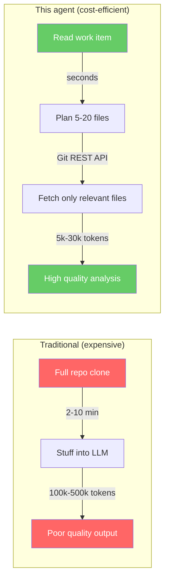
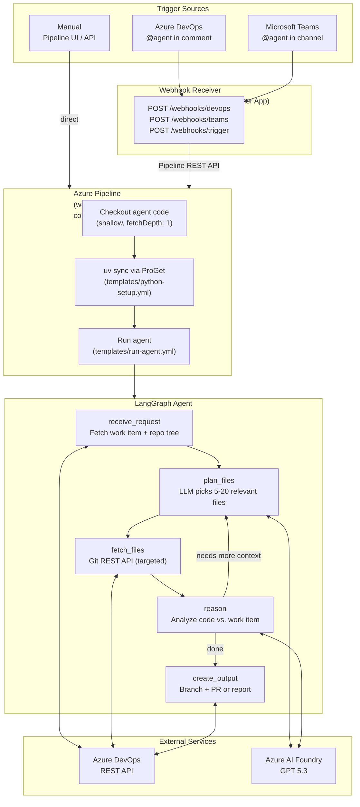
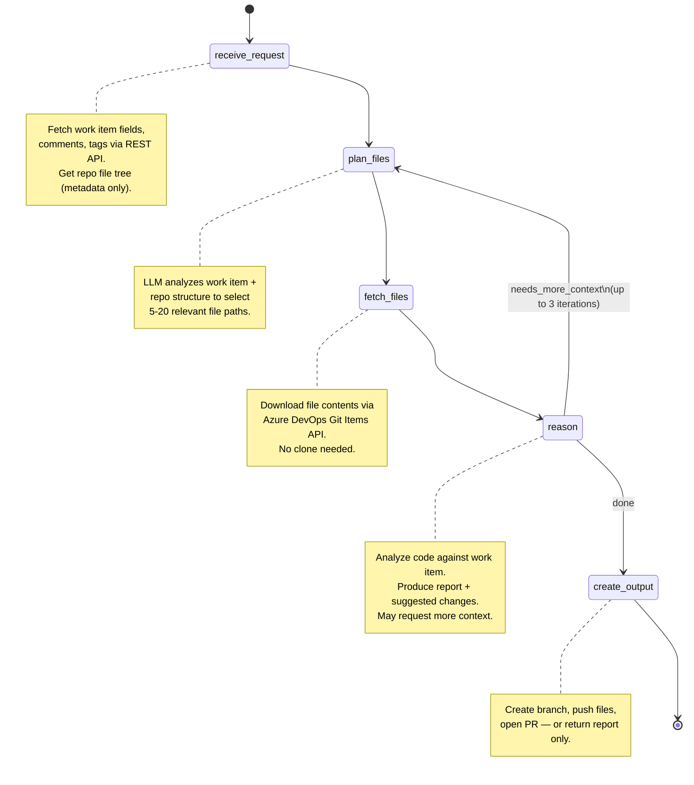
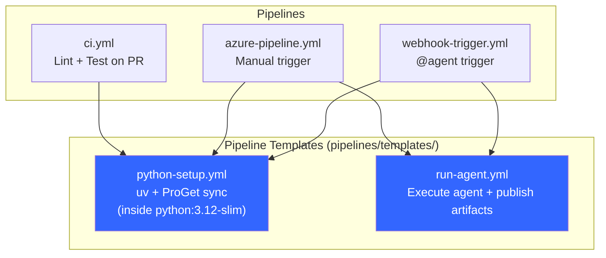
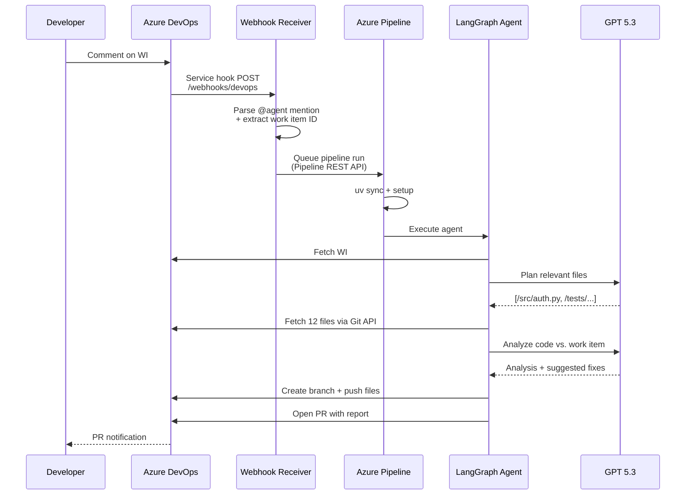
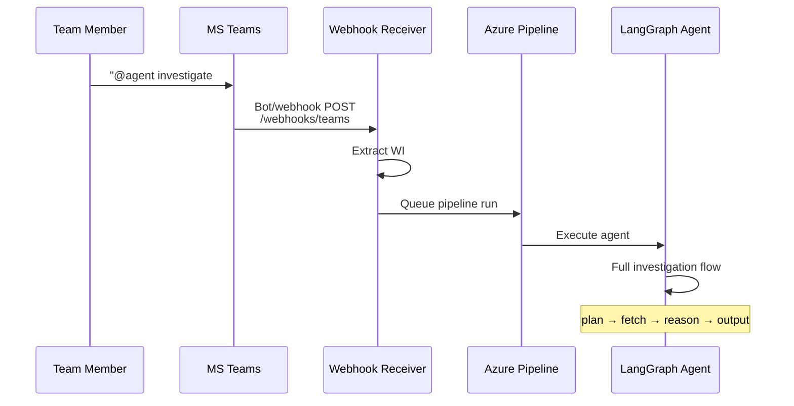
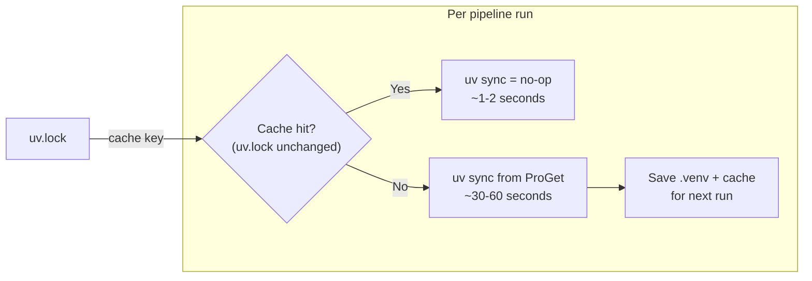
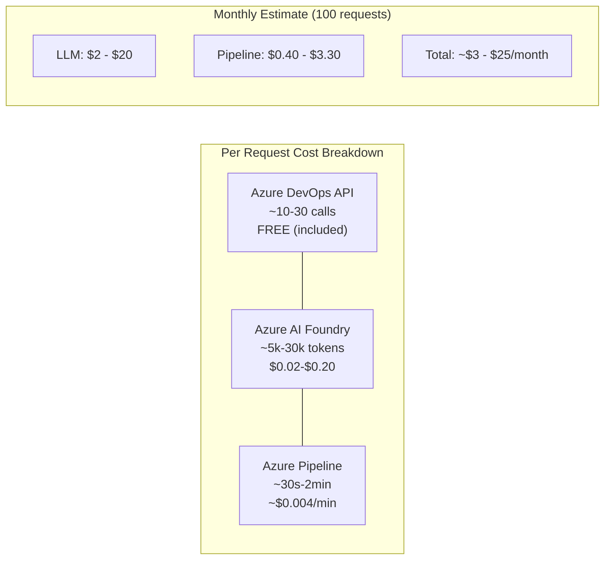
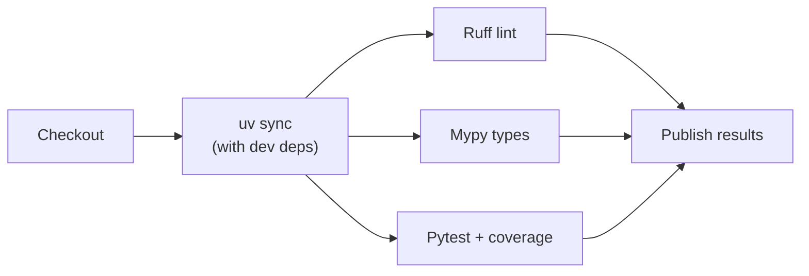

# Azure DevOps Agent

An intelligent agent that investigates Azure DevOps work items (feature requests, bugs, backlog items) using **targeted code retrieval** — never clones the full repo.

Built with [LangGraph](https://github.com/langchain-ai/langgraph), [Azure AI Foundry](https://ai.azure.com/) (GPT 5.3), [Azure Pipelines](https://learn.microsoft.com/en-us/azure/devops/pipelines/), and [uv](https://docs.astral.sh/uv/).

Triggered via **`@agent`** mentions in Azure DevOps work item comments or Microsoft Teams.

---

## Why Targeted Retrieval?



| Metric | Full Repo Approach | This Agent |
|--------|-------------------|------------|
| Tokens per request | 100k-500k+ | 5k-30k |
| Cost per request (GPT 5.3) | $0.50-$5.00+ | $0.02-$0.20 |
| Pipeline minutes | 5-15 min | 30s-2 min |
| Azure DevOps API calls | Hundreds | 10-30 |
| Quality of analysis | Low (needle-in-haystack) | High (focused context) |

---

## Architecture

### End-to-End Flow



### LangGraph Agent Detail



### Pipeline Template Reuse



---

## Setup

### Prerequisites

- **Python 3.12+**
- **[uv](https://docs.astral.sh/uv/)** (Python package manager)
- **[ProGet](https://inedo.com/proget)** PyPI feed (your org's private package index)
- **Azure DevOps** organization with a PAT that has: Code (Read & Write), Work Items (Read & Write), Pull Requests (Read & Write)
- **Azure AI Foundry** project with GPT 5.3 deployed (or another supported model)

### Installation

```bash
cd devops_agent

# Install uv (if not already installed)
curl -LsSf https://astral.sh/uv/install.sh | sh

# Configure ProGet credentials for uv
# (uv reads these env vars to authenticate with the ProGet index
# defined in pyproject.toml under [tool.uv.index])
export UV_HTTP_BASIC_PROGET_USERNAME=api
export UV_HTTP_BASIC_PROGET_PASSWORD=your-proget-api-key

# Sync all dependencies from ProGet (production + dev)
uv sync --all-extras

# Or production only
uv sync --no-dev
```

> **Note:** The ProGet index URL is configured in `pyproject.toml` under `[[tool.uv.index]]`. Update it to match your organization's ProGet feed URL. Authentication uses the `UV_HTTP_BASIC_PROGET_*` environment variables, which uv automatically maps to the index named `proget`.

### Configuration

```bash
# Copy and fill in your credentials
cp .env.example .env
```

Key settings in `.env`:

| Variable | Description | Example |
|----------|-------------|---------|
| `AZURE_DEVOPS_ORG_URL` | Your org URL | `https://dev.azure.com/contoso` |
| `AZURE_DEVOPS_PAT` | Personal Access Token | `xxxx...` |
| `AZURE_DEVOPS_PROJECT` | Project name | `MyProject` |
| `AZURE_DEVOPS_REPOSITORY` | Repo name | `backend-api` |
| `AZURE_AI_FOUNDRY_ENDPOINT` | AI Foundry endpoint | `https://proj.services.ai.azure.com` |
| `AZURE_AI_FOUNDRY_API_KEY` | Foundry API key | `xxxx...` |
| `AZURE_AI_FOUNDRY_MODEL` | Model deployment | `gpt-5.3` |
| `AGENT_PIPELINE_ID` | Webhook-trigger pipeline ID | `42` |
| `PROGET_PYPI_URL` | ProGet PyPI feed URL | `https://proget.contoso.com/pypi/python-packages/simple/` |
| `PROGET_USERNAME` | ProGet username (usually `api`) | `api` |
| `PROGET_API_KEY` | ProGet API key | `xxxx...` |

---

## Usage

### CLI (local development)

```bash
# Investigate a work item
uv run devops-agent investigate --work-item 1234

# With additional context
uv run devops-agent investigate --work-item 1234 --context "Focus on the retry logic"

# Feature request analysis
uv run devops-agent investigate --work-item 1234 --type feature_request

# Report only (no branch/PR creation)
uv run devops-agent investigate --work-item 1234 --report-only

# Free-form request (no work item)
uv run devops-agent request --text "How does the auth flow work?"
```

### Start the Webhook Receiver

```bash
# Start the FastAPI webhook server
uv run devops-agent serve --port 8000
```

Endpoints:
| Method | Path | Source |
|--------|------|--------|
| `POST` | `/webhooks/devops` | Azure DevOps service hook |
| `POST` | `/webhooks/teams` | MS Teams bot / webhook |
| `POST` | `/webhooks/trigger` | Manual / generic HTTP |
| `GET` | `/health` | Health check |

### Trigger from Azure DevOps (`@agent`)



**Setup steps:**

1. In Azure DevOps, go to **Project Settings > Service hooks**
2. Create a new subscription:
   - Service: **Web Hooks**
   - Event: **Work item commented on**
   - Filter: (optional) area path, work item type
   - URL: `https://your-webhook-receiver.azurecontainerapps.io/webhooks/devops`
3. Test with a comment containing `@agent`

### Trigger from MS Teams (`@agent`)



**Setup steps:**

1. Register a Teams bot or use an Outgoing Webhook in your channel
2. Point it to `https://your-webhook-receiver.azurecontainerapps.io/webhooks/teams`
3. Mention `@agent` with a work item reference: `@agent investigate #1234`

### Azure Pipeline (manual)

The pipeline at `pipelines/azure-pipeline.yml` can be run from the Azure DevOps UI with parameters:

| Parameter | Type | Description |
|-----------|------|-------------|
| `workItemId` | number | Work item to investigate |
| `requestType` | string | `investigation`, `feature_request`, or `bug` |
| `additionalContext` | string | Extra context for the agent |
| `reportOnly` | boolean | Skip branch/PR creation |

**Variable group setup:** Create a variable group named `devops-agent-secrets` in **Pipelines > Library** containing:

| Variable | Description |
|----------|-------------|
| `AZURE_DEVOPS_ORG_URL` | Organization URL |
| `AZURE_DEVOPS_PAT` | Personal Access Token |
| `AZURE_DEVOPS_PROJECT` | Project name |
| `AZURE_DEVOPS_REPOSITORY` | Target repository |
| `LLM_PROVIDER` | `azure_ai_foundry` |
| `AZURE_AI_FOUNDRY_ENDPOINT` | Foundry endpoint |
| `AZURE_AI_FOUNDRY_API_KEY` | Foundry API key |
| `AZURE_AI_FOUNDRY_MODEL` | `gpt-5.3` |
| `PROGET_PYPI_URL` | ProGet PyPI feed URL |
| `PROGET_USERNAME` | ProGet user (usually `api`) |
| `PROGET_API_KEY` | ProGet API key |

### Programmatic Usage

```python
import asyncio
from src.config import get_settings
from src.clients.devops import AzureDevOpsClient
from src.clients.llm import get_chat_model
from src.agent.graph import build_graph
from src.agent.state import AgentState

async def main():
    settings = get_settings()
    devops = AzureDevOpsClient(settings)
    llm = get_chat_model(settings)
    graph = build_graph(settings, devops, llm)

    state = AgentState(
        work_item_id=1234,
        request_type="feature_request",
    )

    result = await graph.ainvoke(state)
    print(result["output_summary"])
    await devops.close()

asyncio.run(main())
```

---

## Pipeline Templates

All pipelines reuse shared templates in `pipelines/templates/`:

### `python-setup.yml`

Sets up the Python environment using `uv` with ProGet as the package index. All pipelines run inside a `python:3.12-slim` container — Python is already available, so uv just manages the venv and packages.

**The venv is cached between runs** via Azure Pipelines `Cache@2`, keyed on `uv.lock`. If dependencies haven't changed, `uv sync` is a near-instant no-op (~1-2s instead of 30-60s).

```yaml
container: python:3.12-slim

steps:
  - template: templates/python-setup.yml
    parameters:
      installDev: true    # false for production runs
```

What it does:
1. Installs `uv` via pip (already available in the slim container)
2. **Restores cached `.venv/` and uv package cache** (keyed on `uv.lock`)
3. Runs `uv sync --python-preference=only-system` — if cache hit, this is a no-op
4. On cache miss (deps changed), downloads from ProGet and saves cache for next run
5. Verifies the environment



### `run-agent.yml`

Executes the agent with parameters:

```yaml
steps:
  - template: templates/run-agent.yml
    parameters:
      workItemId: 1234
      requestType: "investigation"
      triggerSource: "devops_mention"
```

---

## Cost Efficiency



GPT 5.3 via Azure AI Foundry supports ~400k token context windows, but this agent deliberately stays under 120k to maximize cost efficiency and reasoning quality.

---

## Development

### Running Tests

```bash
# Run all tests
uv run pytest

# Verbose with coverage
uv run pytest -v --cov=src --cov-report=html

# Specific test file
uv run pytest tests/test_agent.py -v
```

### Linting & Formatting

```bash
# Check lint
uv run ruff check src/ tests/

# Auto-fix
uv run ruff check --fix src/ tests/

# Format
uv run ruff format src/ tests/

# Type check
uv run mypy src/ --ignore-missing-imports
```

### CI Pipeline

The `pipelines/ci.yml` runs on every push/PR and executes:



---

## Project Structure

```
devops_agent/
├── src/
│   ├── main.py                 # CLI entry point (Typer) — investigate, request, serve
│   ├── config.py               # Pydantic settings from env vars
│   ├── agent/
│   │   ├── graph.py            # LangGraph graph definition
│   │   ├── nodes.py            # Node functions (plan, fetch, reason, output)
│   │   ├── prompts.py          # LLM prompt templates
│   │   └── state.py            # Agent state (Pydantic model)
│   ├── clients/
│   │   ├── devops.py           # Azure DevOps REST API client (httpx)
│   │   └── llm.py              # LLM client factory (AI Foundry / OpenAI / Anthropic)
│   ├── utils/
│   │   └── tokens.py           # Token counting & context budget management
│   └── webhooks/
│       └── receiver.py         # FastAPI webhook receiver (DevOps + Teams triggers)
├── pipelines/
│   ├── azure-pipeline.yml      # Manual trigger pipeline
│   ├── webhook-trigger.yml     # @agent trigger pipeline
│   ├── ci.yml                  # CI: lint + test on PR
│   └── templates/
│       ├── python-setup.yml    # Reusable: uv + ProGet (python:3.12-slim)
│       └── run-agent.yml       # Reusable: agent execution
├── tests/
│   ├── test_agent.py           # Agent node tests
│   └── test_devops_client.py   # DevOps client tests
├── .env.example                # Environment variable template
├── .gitignore
├── pyproject.toml              # Project metadata & deps (uv-managed)
└── README.md
```

---

## License

MIT
