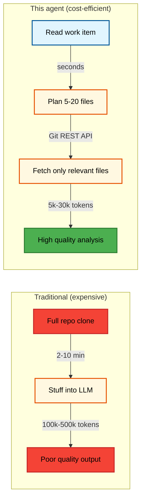
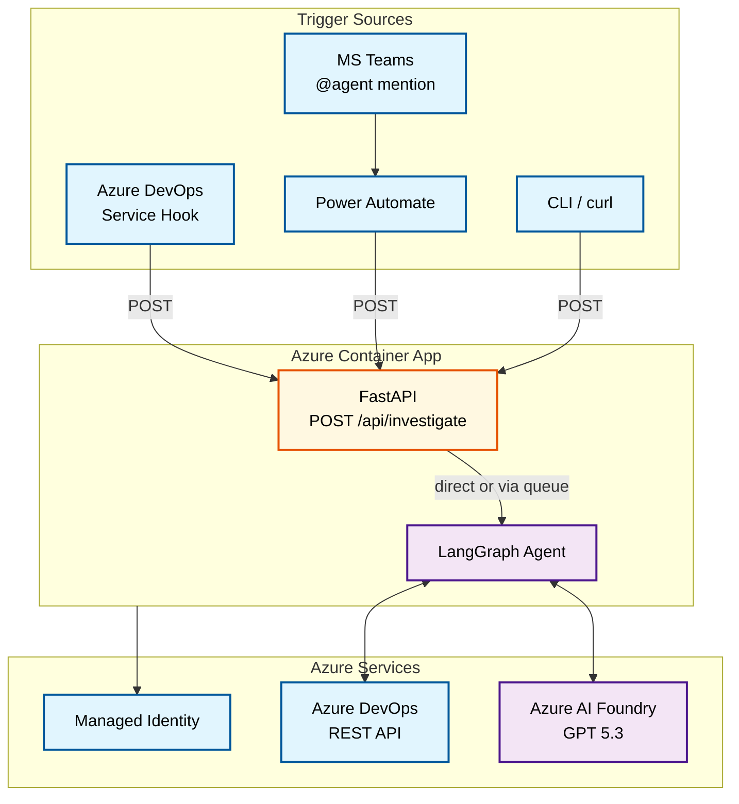
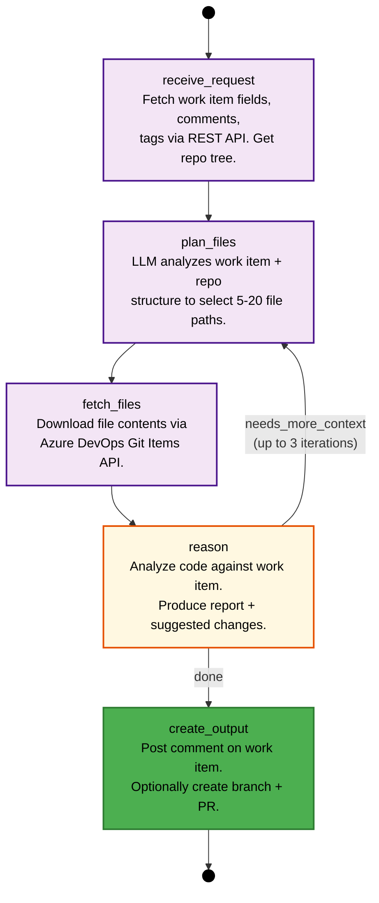
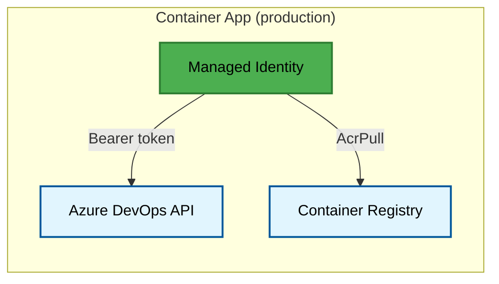
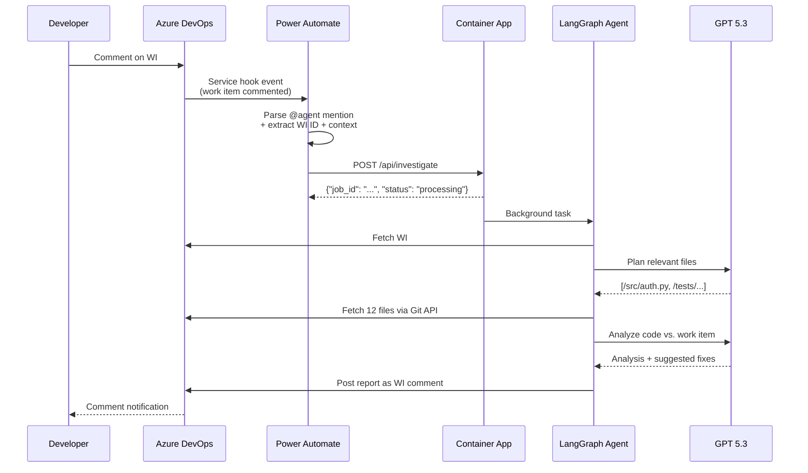
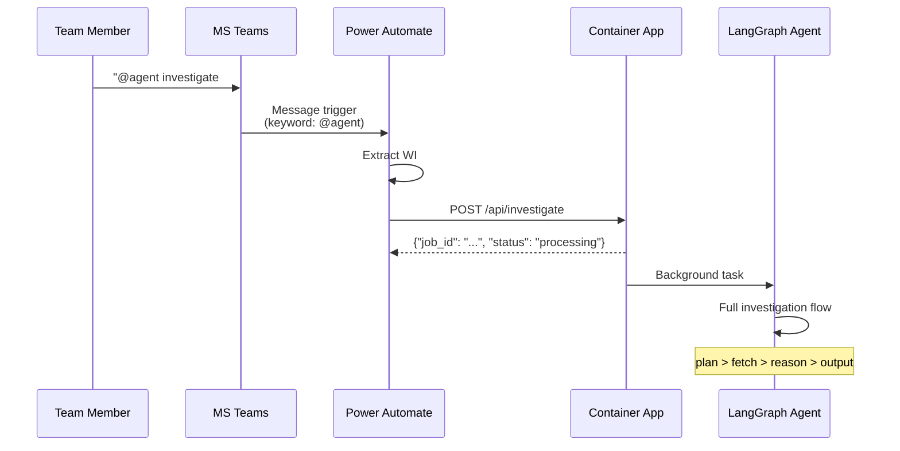
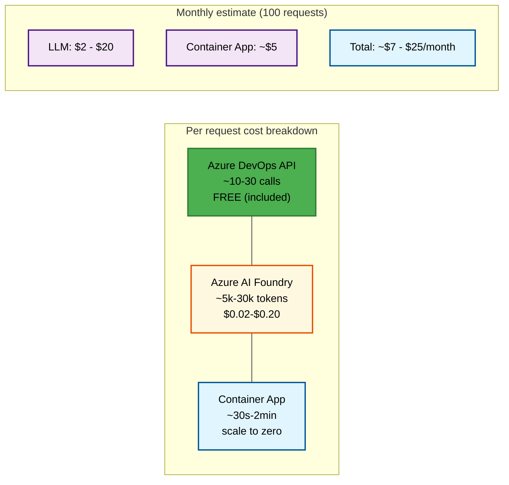

# Azure DevOps Agent

An intelligent agent that investigates Azure DevOps work items (feature requests, bugs, backlog items) using **targeted code retrieval** — never clones the full repo.

Built with [LangGraph](https://github.com/langchain-ai/langgraph), [Azure AI Foundry](https://ai.azure.com/) (GPT 5.3), [Azure Container Apps](https://learn.microsoft.com/en-us/azure/container-apps/), and [uv](https://docs.astral.sh/uv/).

Deployed as a lightweight **Container App** with a single HTTP API. Queue processing via Service Bus is optional. Triggered via **`@agent`** mentions in Azure DevOps work item comments, Microsoft Teams, or direct API calls.

## Table of Contents

- [Why targeted retrieval?](#why-targeted-retrieval)
- [Architecture](#architecture)
- [Setup](#setup)
- [Configuration](#configuration)
- [Usage](#usage)
- [Deployment](#deployment)
- [Safety](#safety-append-only-work-item-updates)
- [Cost efficiency](#cost-efficiency)
- [Development](#development)
- [Project structure](#project-structure)

---

## Why Targeted Retrieval?



| Metric | Full Repo Approach | This Agent |
|--------|-------------------|------------|
| Tokens per request | 100k-500k+ | 5k-30k |
| Cost per request (GPT 5.3) | $0.50-$5.00+ | $0.02-$0.20 |
| Latency | 5-15 min | 30s-2 min |
| Azure DevOps API calls | Hundreds | 10-30 |
| Quality of analysis | Low (needle-in-haystack) | High (focused context) |

---

## Architecture

### End-to-end flow



### Request flow

1. Service hook / Power Automate / CLI sends `POST /api/investigate` with `{"work_item_id": 1234, "request_type": "bug"}`
2. FastAPI validates the request and either processes it directly (background task) or enqueues to Service Bus if configured
3. LangGraph agent runs: plan files, fetch via Git API, reason with LLM, produce output
4. Agent posts report as a work item comment (append-only)
5. Caller can poll `GET /api/status/{job_id}` for result

### LangGraph agent detail



---

## Setup

### Prerequisites

- **Python 3.12+**
- **[uv](https://docs.astral.sh/uv/)** (Python package manager)
- **[ProGet](https://inedo.com/proget)** PyPI feed (your org's private package index)
- **Azure DevOps** organization with permissions: Code (Read & Write), Work Items (Read & Write), Pull Requests (Read & Write)
- **Azure AI Foundry** project with GPT 5.3 deployed (or another supported model)
- **Azure subscription** with Container Apps (Service Bus, Key Vault, VNet are optional)

### Local installation

```bash
cd devops_agent

curl -LsSf https://astral.sh/uv/install.sh | sh

export UV_HTTP_BASIC_PROGET_USERNAME=api
export UV_HTTP_BASIC_PROGET_PASSWORD=your-proget-api-key

uv sync --all-extras
```

> **Note:** The ProGet index URL is configured in `pyproject.toml` under `[[tool.uv.index]]`. Update it to match your organization's ProGet feed URL.

---

## Configuration

```bash
cp .env.example .env
```

Key settings in `.env`:

| Variable | Description | Example |
|----------|-------------|---------|
| `AZURE_DEVOPS_ORG_URL` | Your org URL | `https://dev.azure.com/contoso` |
| `AZURE_DEVOPS_PROJECT` | Project name | `MyProject` |
| `AZURE_DEVOPS_REPOSITORY` | Repo name | `backend-api` |
| `DEVOPS_AUTH_MODE` | `managed_identity` or `system_token` | `managed_identity` |
| `MANAGED_IDENTITY_CLIENT_ID` | MI client ID (set by Bicep) | `00000000-...` |
| `AZURE_AI_FOUNDRY_ENDPOINT` | AI Foundry endpoint | `https://proj.services.ai.azure.com` |
| `AZURE_AI_FOUNDRY_API_KEY` | Foundry API key | `xxxx...` |
| `AZURE_AI_FOUNDRY_MODEL` | Model deployment | `gpt-5.3` |
| `SERVICE_BUS_CONNECTION_STR` | *(optional)* Service Bus connection | `Endpoint=sb://...` |
| `KEY_VAULT_URL` | *(optional)* Key Vault URL | `https://devops-agent-kv.vault.azure.net` |

### Authentication

All authentication uses **Managed Identity** — no PATs, no stored secrets. The Bicep deployment creates a User-assigned MI and grants it the required roles automatically.



---

## Usage

### HTTP API

The Container App exposes these endpoints:

| Method | Path | Description |
|--------|------|-------------|
| `POST` | `/api/investigate` | Submit a work item investigation |
| `GET` | `/api/status/{job_id}` | Poll for job status and results |
| `GET` | `/health` | Liveness probe |

**Example: Submit an investigation**

```bash
curl -X POST https://<your-app>.azurecontainerapps.io/api/investigate \
  -H "Content-Type: application/json" \
  -d '{"work_item_id": 1234, "request_type": "bug", "report_only": true}'
```

**Response:**

```json
{"job_id": "a1b2c3...", "status": "queued", "message": "Job enqueued for processing"}
```

### CLI (for local testing)

```bash
# Uses DEVOPS_AUTH_MODE=system_token with a token from `az` login
uv run devops-agent investigate --work-item 1234

uv run devops-agent investigate --work-item 1234 --context "Focus on the retry logic"

uv run devops-agent investigate --work-item 1234 --type feature_request

# Start the API server locally
uv run devops-agent serve
```

### Trigger from Azure DevOps (e.g. `@domeinteam_devops_agent`)

Azure DevOps doesn’t call the agent directly. You connect a **service hook** (work item commented) to a **Power Automate** flow; the flow looks for a **keyword in the comment** (e.g. `@domeinteam_devops_agent`) and POSTs to the Container App. No Azure DevOps user with that name is required — it’s just the string the flow matches.



**Step-by-step:** See **[docs/TRIGGER-FROM-WORK-ITEM.md](docs/TRIGGER-FROM-WORK-ITEM.md)** for:

1. Creating a Power Automate flow with an HTTP trigger (to receive the service hook).
2. Parsing the payload and calling `POST https://<your-app>.azurecontainerapps.io/api/investigate` with `work_item_id`, `context`, and optional `request_type` / `report_only`.
3. Creating the Azure DevOps service hook (e.g. **Work item commented**) and pointing it at the flow’s HTTP URL.
4. Testing with a comment like *"@domeinteam_devops_agent investigate the auth bug"* on a work item (use whatever handle you configured in the flow).

### Trigger from MS Teams (`@agent`)

Same approach — Power Automate flow triggered by a Teams message containing `@agent`:



---

## Deployment

### Quick start (3 resources)

The Bicep template deploys the **minimum** needed to run: Managed Identity + Container App Environment + Container App. Service Bus and Key Vault are optional add-ons.

```bash
RG="rg-devops-agent"

# 1. Build and push
az acr build --registry devopsagentacr --image devops-agent:latest .

# 2. Deploy (just workload name + DevOps config)
az deployment group create -g $RG -f infra/main.bicep \
  -p workloadName='devops-agent' \
     devopsOrgUrl='https://dev.azure.com/contoso' \
     devopsProject='MyProject' \
     devopsRepository='backend-api' \
     acrName='devopsagentacr'
```

All resource names derive from the workload name:

| Resource | Name |
|----------|------|
| Managed Identity | `devops-agent-id` |
| Container App Env | `devops-agent-env` |
| Container App | `devops-agent-app` |

Without Service Bus the app processes requests directly — no queue overhead. Add `deployServiceBus=true` later when you need retries and dead-letter handling.

See **[infra/DEPLOY.md](infra/DEPLOY.md)** for the full step-by-step guide with CLI troubleshooting.

### Scaling

The Container App is configured to scale between 0 and 3 replicas. It scales to zero when idle, keeping costs minimal. HTTP-based scaling adds replicas when concurrent requests increase.

---

## Safety: Append-Only Work Item Updates

The agent **never removes or overwrites** existing work item content. All findings are posted as **new comments** — immutable entries in the work item history.

| Operation | Allowed | Method |
|-----------|---------|--------|
| Add comment to work item | Yes | `add_work_item_comment()` — appends to history |
| Add tag / link to work item | Yes | `update_work_item()` with `op: "add"` only |
| Replace description / title | **Blocked** | Raises `ValueError` at runtime |
| Remove fields / tags | **Blocked** | Raises `ValueError` at runtime |

Default mode is **report-only** (`report_only: true`) — the agent posts its analysis as a comment and stops. Branch/PR creation must be explicitly opted into.

---

## Cost Efficiency



GPT 5.3 via Azure AI Foundry supports ~400k token context windows, but this agent deliberately stays under 120k to maximize cost efficiency and reasoning quality.

---

## Development

### Running tests

```bash
uv run pytest
uv run pytest tests/unit/ -v
uv run pytest -v --cov=src --cov-report=html
```

### Linting & formatting

```bash
uv run ruff check src/ tests/
uv run ruff check --fix src/ tests/
uv run ruff format src/ tests/
uv run mypy src/ --ignore-missing-imports
```

### Running locally with Docker

```bash
docker build -t devops-agent .
docker run -p 8000:8000 --env-file .env devops-agent
```

---

## Project Structure

```
devops_agent/
├── src/
│   ├── main.py                 # CLI entry point — investigate, request, serve
│   ├── api.py                  # FastAPI app (direct mode or queued via Service Bus)
│   ├── worker.py               # Service Bus queue consumer (optional)
│   ├── config.py               # Pydantic settings from env vars
│   ├── agent/
│   │   ├── graph.py            # LangGraph graph definition
│   │   ├── nodes.py            # Node functions (plan, fetch, reason, output)
│   │   ├── prompts.py          # LLM prompt templates
│   │   └── state.py            # Agent state (Pydantic model)
│   ├── clients/
│   │   ├── devops.py           # Azure DevOps REST API client (httpx)
│   │   └── llm.py              # LLM client factory (AI Foundry / OpenAI / Anthropic)
│   └── utils/
│       └── tokens.py           # Token counting & context budget management
├── infra/
│   ├── main.bicep              # All infrastructure (workload-name-based)
│   ├── parameters.bicepparam   # Environment-specific values
│   └── DEPLOY.md               # Step-by-step deployment + CLI troubleshooting
├── tests/
│   ├── conftest.py             # Shared fixtures
│   └── unit/
│       ├── test_agent.py       # Agent node tests
│       ├── test_api.py         # API endpoint tests
│       ├── test_worker.py      # Worker tests
│       └── test_devops_client.py  # DevOps client tests
├── Dockerfile                  # Container image (python:3.12-slim + uv)
├── .env.example
├── .gitignore
├── pyproject.toml              # Project metadata & deps (uv-managed)
└── README.md
```

---

## License

MIT
